# Company Flow Management App

A focused Django application for small-to-medium construction and materials businesses to track sales, customer balances, cashflow, machinery (JCB) operations, and inventory-like material records (cement, blocks, bamboo) — with practical tools for due-date alerts and exportable reporting.

This README documents the current state of the project (May 2026), highlights recent enhancements, explains core modules and workflows, and provides developer setup and maintenance instructions suitable for a GitHub repository.

---

**Contents**

- Project overview
- Recent enhancements (what changed)
- Features and modules (detailed)
- Data model overview
- Typical user workflows
- Developer setup (env, run, tests)
- Management commands
- File and route reference (quick links)
- Changelog (recent)
- Contributing & license

---

## Project overview

Company Flow Management App provides day-to-day operational tracking for businesses that sell materials and hire machinery. It focuses on:

- Sales invoicing and receipts, with customer-level credit handling
- Cash transactions and categories
- Machine (JCB) work logs and rate-based calculations
- Tipper, blocks, cement, and bamboo records for inventory and sales flows
- Alerts for overdue and upcoming dues
- Lightweight analytics via dashboard cards and exportable CSV/PDF reports

The app favors pragmatic UX (partial updates via HTMX, compact item entry tables) and stores flexible sale item lines in a JSONField to avoid frequent migrations while allowing schema changes in validation and UI.

---

## Features and modules (detailed)

The app is split into focused modules under the `core` app. Major capabilities:

- Sales
  - Create and edit sales invoices with flexible item lines stored as JSON (`Sale.items`).
  - Item line fields: `item` (name), optional `unit`, `quantity`, `price`, and `amount`.
  - Invoice lifecycle: Pending / Paid states; receipts can be attached to sales as `Transaction` records.
  - Alerts: per-sale `alert_enabled` flag triggers overdue/upcoming alert generation using `due_date`.
  - CSV/PDF export with item-level summaries (items, quantities, units, and human-readable item lines).

- Customers
  - Customer profiles with optional `credit_balance`, `opening_balance`, and a `manual_due_amount` for legacy adjustments.
  - Allocate customer payments to multiple pending invoices with allocation history.
  - Pending due context now combines core sales, material sales, and assigned pending JCB work for clearer customer-level receivables.

- Transactions / Finance Ledger
  - Categorized income/expense transactions with optional attachment and links to customers, sales, or records.
  - Predefined categories and free-form categories supported.
  - Customer-assigned expense settlement: when an `expense` transaction is created/edited/deleted with a customer assigned,
    the system will deduct up to the customer's available `credit_balance` and move any remainder into the customer's
    `manual_due_amount` (so balances never go negative). The transaction now records `expense_credit_applied` and
    `expense_due_remainder` for auditability and these values are shown on the transaction detail page.

- Machine (JCB) records
  - Track start/end times, calculated total work hours, rate-based income, and optional expense items.
  - Optional customer assignment on JCB entries (existing customer or create by name).
  - Mark paid/unpaid and include in transaction linking.
  - Customer-aware list filtering and unassigned-record filtering.

- Tipper records
  - Track per-item expense or value-added entries with optional descriptions and simple analytics.

- Material records (Blocks, Cement, Bamboo)
  - Track investments, sales, stock units, and unit-type distinctions (where applicable, e.g., cement/blocks may have unit types).
  - Each has a dedicated analytics card on the dashboard.

- Alerts
  - Overdue and upcoming pipelines powered by `AlertNotification` entries.
  - Manual alert creation for ad-hoc reminders and timeline.

- Dashboard and analytics
  - KPI cards, trend charts, and date-range filtering (HTMX for partial updates).
  - Exports for major tables (transactions, sales, JCB, tipper, material records).
  - Sales KPIs and sales trend now aggregate across the full "sales universe": direct `Sale` records plus
    `BlocksRecord`, `CementRecord`, and `BambooRecord` sale rows. Top-customer ranking uses the combined totals.
  - Overdue KPI now counts overdue items coming from both direct invoices and material sale modules (blocks/cement/bamboo)
    using the same alert-enabled / past-due rule set used by the Alerts module.

---

## Data model (high-level)

- `Customer`: profile data, `opening_balance`, `credit_balance`, `manual_due_amount`.
- `Sale`: invoice metadata, `items` (JSON list of item dicts), `total_amount`, `paid_amount`, `due_date`, `alert_enabled`.
- `Transaction`: income/expense records; may link to `Sale`, `Customer`, `JCBRecord`, and material records.
- `JCBRecord`: machine run logs with `start_time`, `end_time`, `total_work_hours`, `rate`, calculated `total_amount`, and optional `customer` assignment.
- `TipperRecord` & `TipperItem`: tipper-specific records and normalized items.
- `BlocksRecord`, `CementRecord`, `BambooRecord`: domain-specific material records.
- `AlertNotification`: centralized alert entries for overdue/upcoming/manual items.

Relationships: `Customer` 1:N `Sale` and `Transaction`; `Sale` 1:N `Transaction` (receipts). Many material records may point to customers or transactions for reconciliation.

---

## User workflows (how-to summaries)

- Create a Sale
  1. Go to Sales → Add Sale.
  2. Add item rows: choose or type item name, select `unit` if applicable, set `quantity` and `price`.
  3. Save. The `items` JSON payload will be validated server-side for numeric quantities/prices and valid `unit` values when present.

- Record a Receipt for a Sale
  1. Open sale detail → Add Receipt.
  2. Enter amount and payment method.
  3. Receipt links to sale and updates payment state; if fully paid, sale status becomes Paid and open dues/alerts are resolved.

- Customer Payment Allocation
  - Create a `CustomerPayment` and allocate amounts across multiple customer invoices using the allocation UI.

- Create a JCB Record with Optional Customer
  1. Go to JCB Records -> Add JCB Record.
  2. Optionally assign a customer (type an existing name or a new one).
  3. Save the record. Assigned JCB entries participate in customer due/pending views, and paid JCB entries sync customer-linked income transactions.

- Alerts
  - Alerts are auto-generated for sales with `alert_enabled` and `due_date` via the management command `process_alert_notifications` or background scheduler.
  - Manual alerts may be created/edited in the Alerts section.

- Exporting
  - Use the export controls on the list views to export CSV or PDF. Sales exports now include item-level summaries for easier analysis.

---

## Developer setup (local)

Prerequisites

- Python 3.11+
- PostgreSQL (recommended for development parity)
- pip

Quick start (Windows PowerShell)

```powershell
git clone <your-repository-url>
cd CompanyFlowManagementApp
python -m venv env
.\env\Scripts\Activate.ps1
pip install -r requirements.txt
```

Create `.env` (example)

```env
DJANGO_SECRET_KEY=replace-with-a-secure-key
DJANGO_DEBUG=True
DJANGO_ALLOWED_HOSTS=127.0.0.1,localhost
POSTGRES_DB=company_flow_db
POSTGRES_USER=postgres
POSTGRES_PASSWORD=postgres
POSTGRES_HOST=127.0.0.1
POSTGRES_PORT=5432
```

Migrate & create admin

```bash
python manage.py migrate
python manage.py createsuperuser
```

Note: this repository includes a recent schema change adding two audit fields on `Transaction` (`expense_credit_applied`,
`expense_due_remainder`) and the migration `core/migrations/0033_transaction_expense_settlement_fields.py` — run `migrate`
before running tests or starting the app.

Run dev server

```bash
python manage.py runserver
# or bind to 0.0.0.0:9000 for external access
python manage.py runserver 0.0.0.0:9000
```

Sanity checks & tests

```bash
python manage.py check
python manage.py test
# Use test settings with SQLite for restricted DB environments
python manage.py test --settings=config.settings_test
```

If your environment restricts creating test databases (Postgres permission errors), run the checks and targeted tests
in a permitted environment or use `--settings=config.settings_test` to run against a local SQLite test configuration.

---

## Management commands

- `process_alert_notifications` — create/update overdue and upcoming alert timeline entries.
- `sync_paid_sales_income` — backfill and sync automatic paid-sale income transactions used to keep accounting entries aligned.

(See `core/management/commands/` for command implementations.)

---

## File & route references (quick)

Key templates and modules:

- Template: [templates/core/sale_form.html](templates/core/sale_form.html) — sales item entry UI (unit dropdown, add-row autofocus, horizontal scrolling)
- Template: [templates/core/sale_detail.html](templates/core/sale_detail.html) — sale detail and receipts panel
- Template partial: [templates/core/partials/sales_table.html](templates/core/partials/sales_table.html) — sales ledger table used across list views and exports
- Core module: [core/forms.py](core/forms.py) — form validation, including `SALE_ITEM_UNIT_OPTIONS` and `SaleForm.clean_items`
- Core module: [core/report_exports.py](core/report_exports.py) — export definitions and item summarization logic
- Template: [templates/core/material_record_detail.html](templates/core/material_record_detail.html) — shared detail view for blocks/cement/bamboo with sale itemized-style table section
- Template: [templates/core/jcb_record_form.html](templates/core/jcb_record_form.html) — JCB entry form with optional customer assignment
- Template: [templates/core/jcb_records.html](templates/core/jcb_records.html) — JCB list/filter UI (includes customer filter)
- Template partial: [templates/core/partials/jcb_records_table.html](templates/core/partials/jcb_records_table.html) — JCB listing table with customer column
- Core module: [core/views.py](core/views.py) — customer due aggregation, JCB transaction sync, and list filtering logic
- Template: [templates/core/transaction_detail.html](templates/core/transaction_detail.html) — now shows `Credit Deducted` and `Moved to Due` for
  customer-assigned expense entries.
 - Migration: [core/migrations/0033_transaction_expense_settlement_fields.py](core/migrations/0033_transaction_expense_settlement_fields.py)
- Base template: [templates/base.html](templates/base.html) — navbar / topbar responsive tweaks

Main routes (examples)

- `/` — Dashboard
- `/sales`, `/sales/new`, `/sales/<id>`, `/sales/<id>/edit`
- `/customers`, `/customers/new`, `/customers/<id>/allocate-payment`
- `/cash-entries`, `/jcb-records`, `/tipper-records`, `/blocks-records`, `/cement-records`, `/bamboo-records`
- `/alerts`, `/alerts/manual/new`
- Authentication: `/accounts/login`, `/accounts/logout`

---

## Changelog (short)

- 2026-05-07 — Added optional customer assignment flow for JCB records; JCB customer filtering; customer-profile due/pending aggregation now includes assigned pending JCB work; material sale detail pages now show itemized-style sale breakdown.
- 2026-04-28 — Added optional `unit` for sale items; extended sales exports with item-level columns; sales UI and due_date defaults; navbar responsive fixes.
 - 2026-05-13 — Dashboard & overdue KPI: `Total Sales`, `Sales Trend`, and `Top Customers` now include combined sales from `Sale`, `BlocksRecord`, `CementRecord`, and `BambooRecord`.
   Overdue KPI now includes overdue material sale rows (blocks/cement/bamboo) using the same alert rules as invoices.
   Expense settlement: customer-assigned `Transaction` of type `expense` now deducts available customer credit up to the expense amount and moves any remainder into `Customer.manual_due_amount`.
   Audit: `Transaction` now stores `expense_credit_applied` and `expense_due_remainder`; the transaction detail page displays these values.
   Added migration `0033_transaction_expense_settlement_fields.py` and regression tests covering create/edit/delete lifecycle for expense settlement.
- (Previous entries retained in project `roadmap.txt` and commit history.)

---

## Visual assets and screenshots

The `assets/` folder contains example screen captures used in documentation and for quick visual reference. Below are a selection of current screenshots demonstrating dashboard, forms, and list views.

- Dashboard

  

- Authentication

  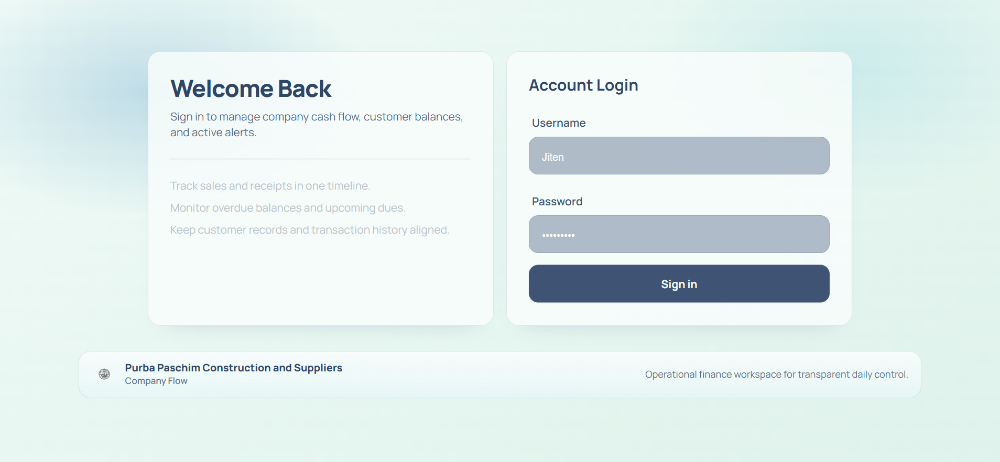
  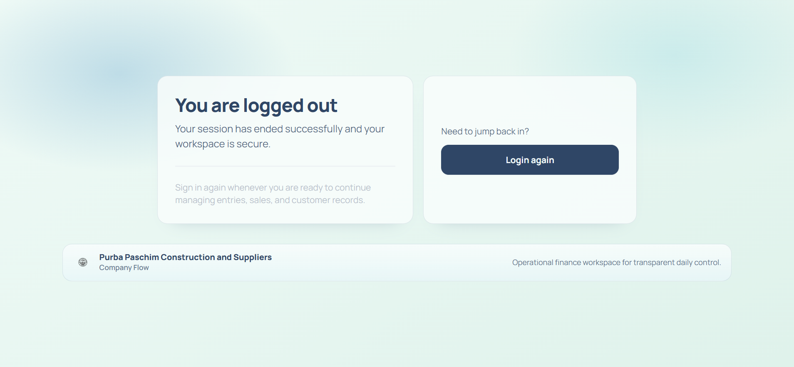

- Finance Ledger

  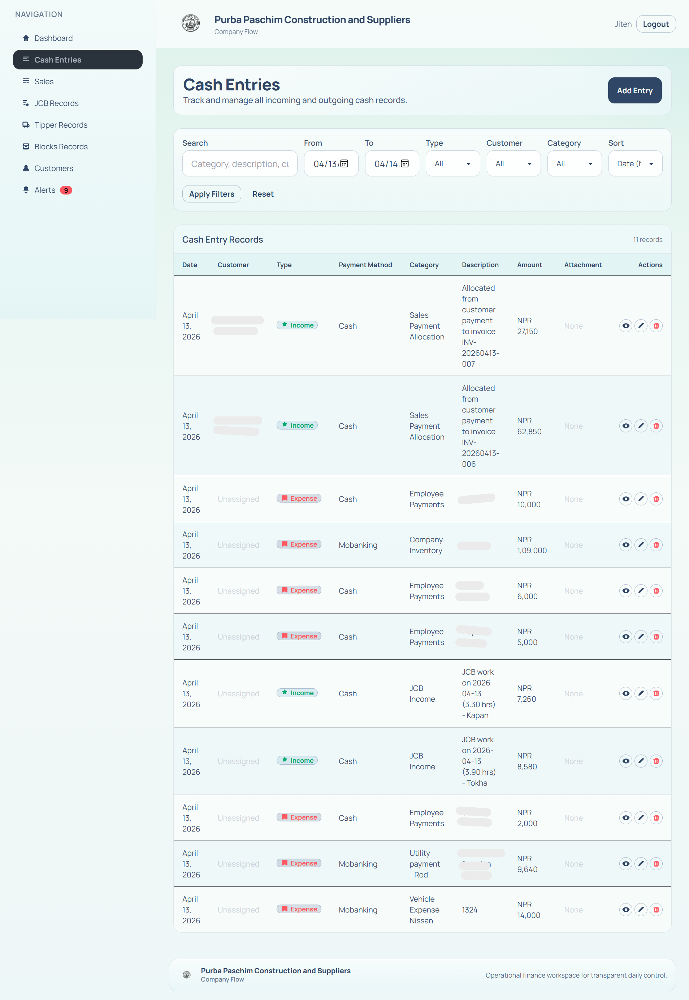
  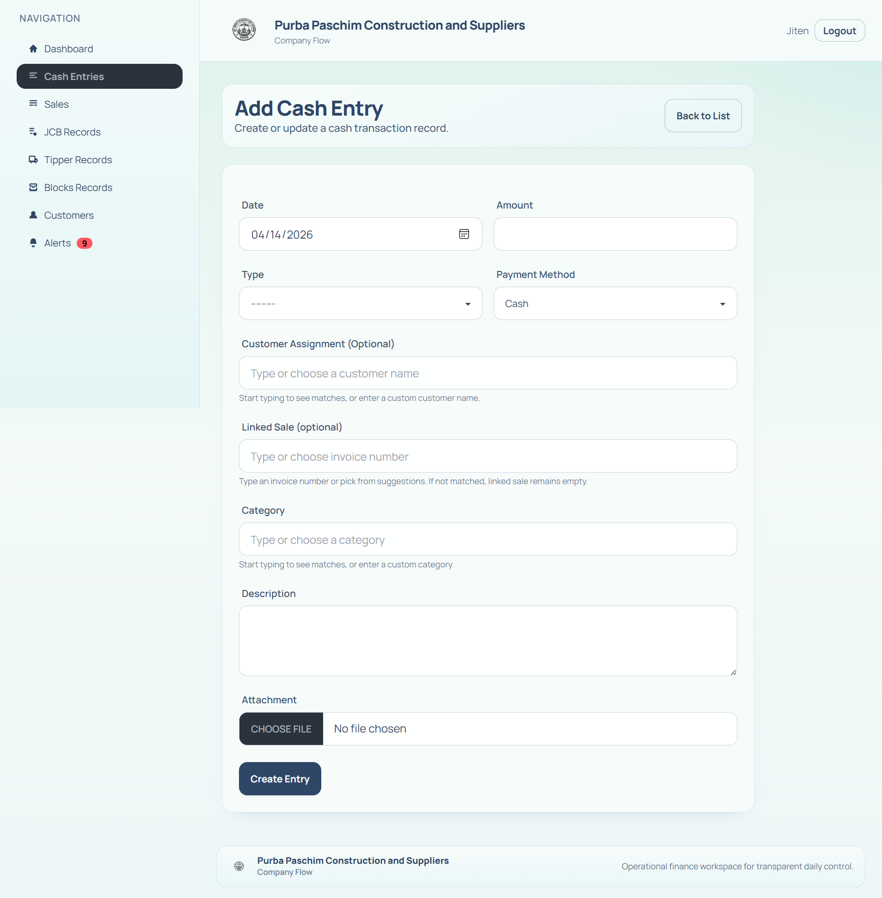

- Sales

  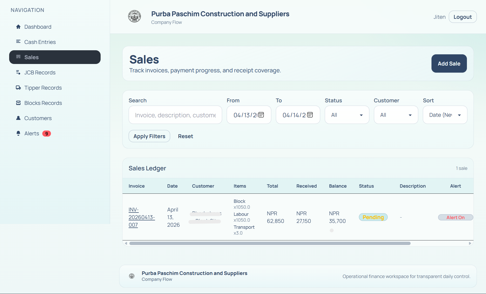
  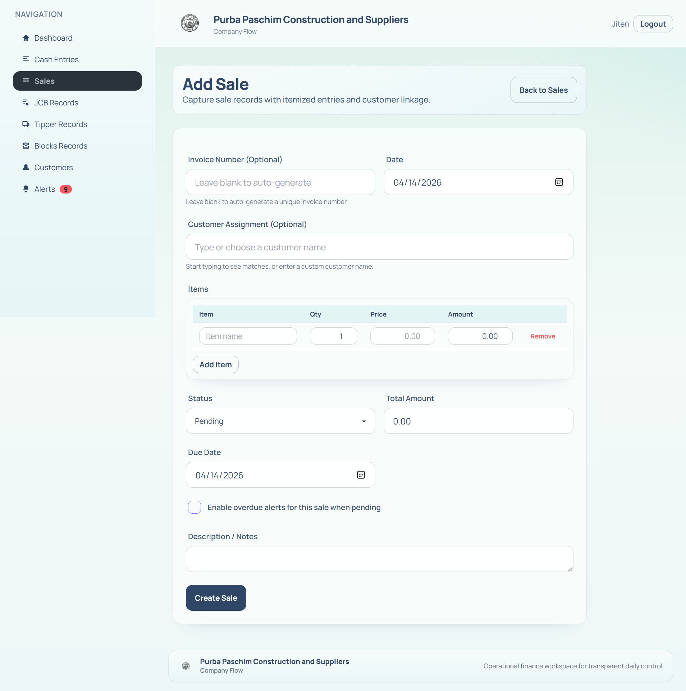

- JCB Records

  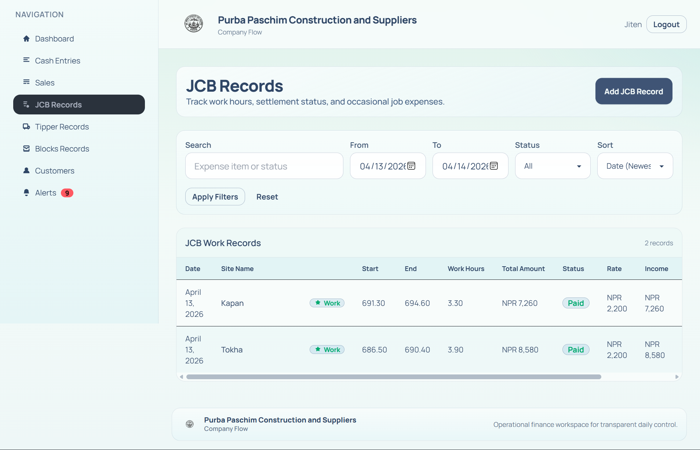
  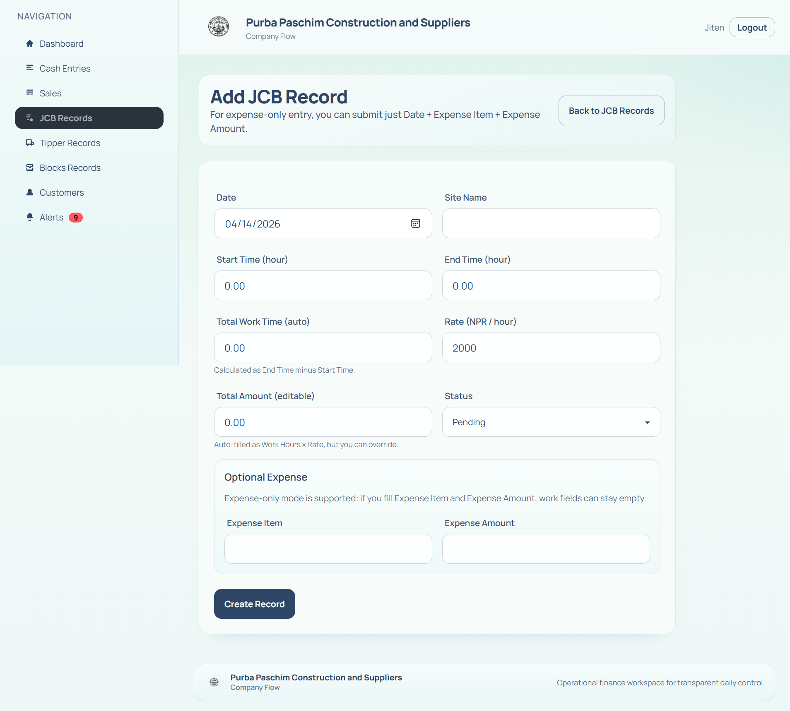

- Tipper Records

  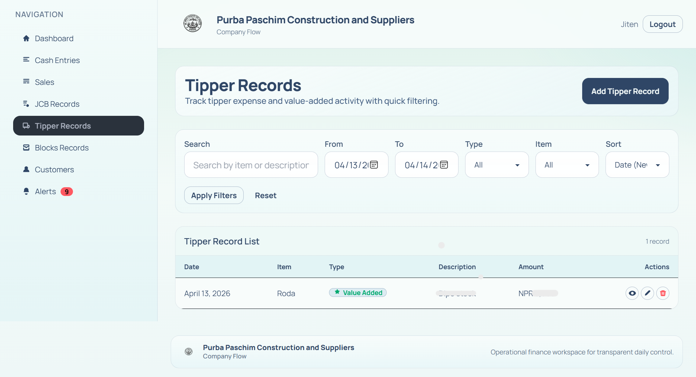
  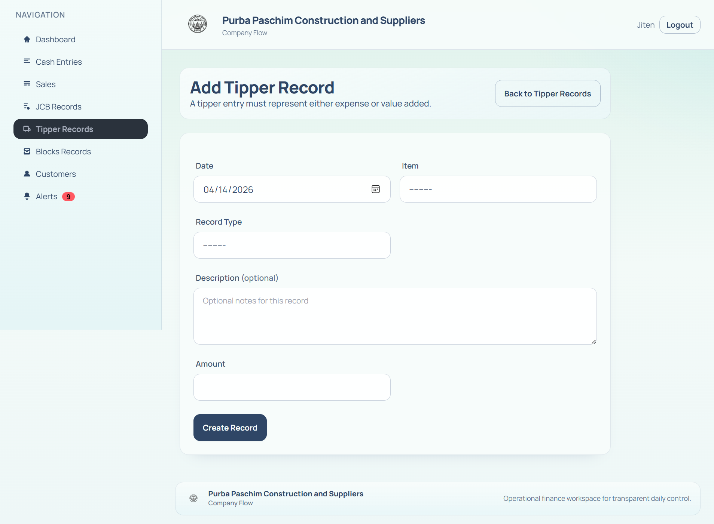

- Blocks & Customers

  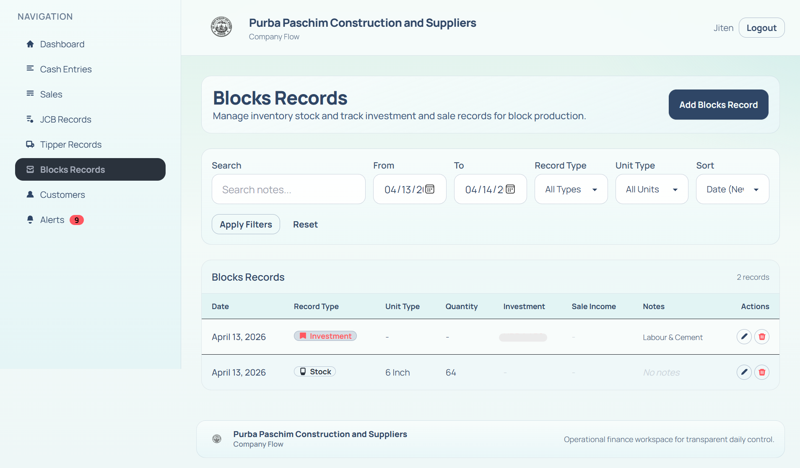
  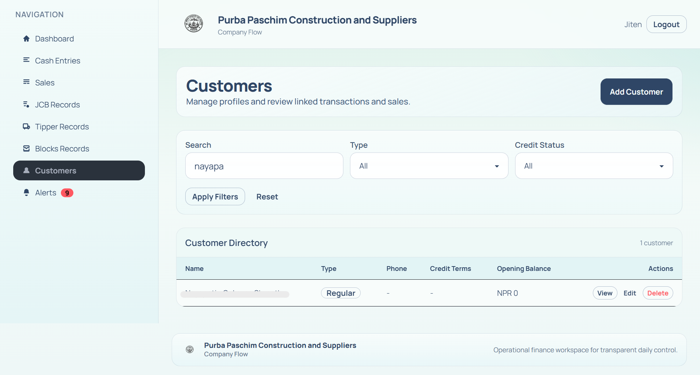
  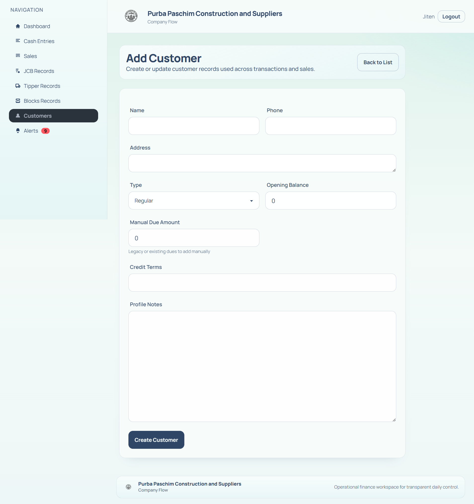

- Alerts

  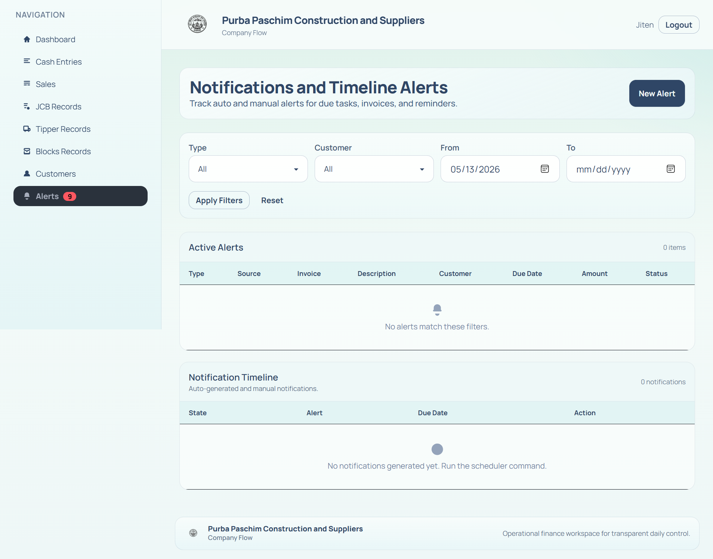
  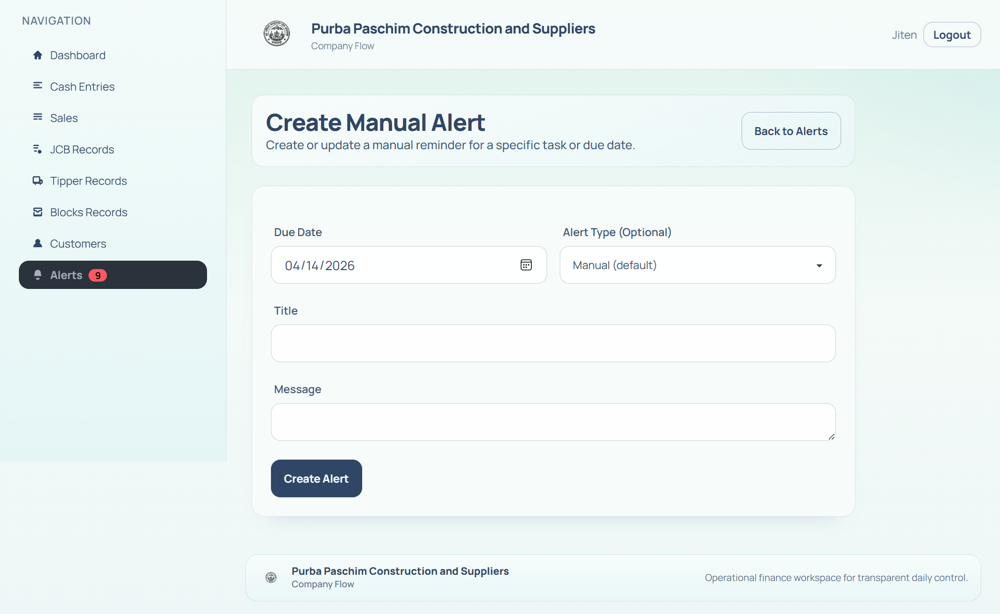


## Contributing

- Follow the code style used in the `core` app.
- Run `python manage.py check` and `python manage.py test` before creating PRs.
- For schema-like changes to sale item structure, prefer additive server-side validation and UI migration steps (no DB migration required while using JSONField).

---

## License

Add your license here (e.g., MIT, Apache-2.0, or Proprietary). Currently unspecified.

---

If you'd like, I can:

- Add a `CHANGELOG.md` with versioned entries and more historic detail.
- Expand the README with screenshots embedded from `assets/` and captions.
- Add a short architecture diagram (Mermaid) describing main entity relationships.

